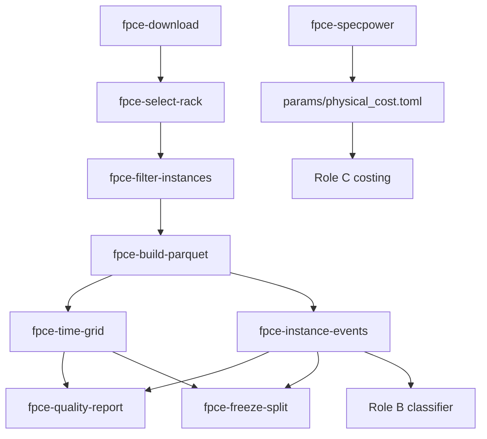

# Ingestion pipeline

End-to-end flow from raw Alibaba trace to instance-level events plus a host time grid.

## Overview



## Stages

### 1. Download (`fpce-download`)

- **Input:** Alibaba OSS mirror (public HTTP)
- **Output:** `data/raw/*.csv`, `data/raw/batch_instance.tar.gz` (~20 GB)
- **Verify:** `scripts/check_download.sh` (size + sha256)

### 2. Rack selection (`fpce-select-rack`)

- **Input:** `data/raw/machine_meta.csv`
- **Output:** `data/processed/rack_machine_ids.json` (primary, domain 51), `replication_rack_machine_ids.json` (domain 52)
- **Rule:** 40 homogeneous machines per rack (same cpu_num, mem_size, failure domain)

### 3. Filter instances (`fpce-filter-instances`)

- **Input:** `batch_instance.tar.gz` + both rack JSONs
- **Output:** `data/interim/batch_instance_*.csv` (~13M rows/rack)
- **Note:** Single pass over 1.35B rows

### 4. Build parquet (`fpce-build-parquet`)

- **Input:** Raw CSVs + filtered instance CSVs
- **Output per rack:** `machine_usage.parquet`, `batch_task.parquet`, `batch_instance.parquet`

### 5. Time grid (`fpce-time-grid`)

- **Input:** Rack parquets
- **Output:** `time_grid.parquet` (1-min host grid; **feature source**, not the label table)
- **Memory:** Use `scripts/run_time_grid_chunked.sh` (one machine at a time)

### 6. Instance events (`fpce-instance-events`)

- **Input:** `batch_instance.parquet` + `batch_task.parquet`
- **Output:** `instance_events.parquet` (prediction unit: one row per instance, `failed` label, waste window)

### 7. Quality & split

- `fpce-quality-report` → `reports/data_quality.json`
- `fpce-freeze-split` → `data/processed/primary_time_split.json` (75% train / 25% test by `start_time`)

## One-command reproduction

```bash
pip install -e .
bash scripts/run_ingest.sh
```

## Validation without full re-run

```bash
python scripts/validate_config.py
python scripts/horizon_sensitivity.py
pytest
```
